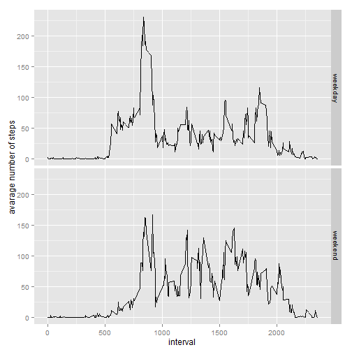

#Loading and preprocessing the data


```r
act = read.csv("./activity.csv")
actSum = summarise(group_by(act,date), sum(na.omit(steps)))
names(actSum)[2] = "NumberOfSteps"
dayNumber = matrix(1:61,61,1)
actSum = cbind(dayNumber, actSum)
```
#What is mean total number of steps taken per day?

```r
plot = ggplot(actSum, aes(x = dayNumber, y = NumberOfSteps)) + 
        geom_bar(stat="identity",col="red",aes(fill=NumberOfSteps))+
         labs(title="Histogram for Number of Steps")+
           labs(x="Day Number", y="Steps")
plot
```

 

```r
ggsave(plot, file="plot1.jpg")
```

```
## Saving 7 x 7 in image
```

```r
#Reporting mean and median.
mean_actSum = as.integer(mean(actSum[[3]]))
median_actSum = as.integer(median(actSum[[3]]))
mean_actSum
```

```
## [1] 9354
```

```r
median_actSum
```

```
## [1] 10395
```
#What is the average daily activity pattern?

```r
groupingTime = group_by(act, interval)
actSumTime = summarise(group_by(act,interval), sum(na.omit(steps)))
names(actSumTime)[[2]] = "Steps"

p = ggplot(actSumTime, aes(x=interval, y=Steps))
p = p + geom_line()
p
```

 

```r
ggsave(p, file="plot2.jpg")
```

```
## Saving 7 x 7 in image
```

```r
actSumTime = summarise(group_by(act,interval), sum(na.omit(steps)), mean(na.omit(steps)))
names(actSumTime) = c("interval","Steps", "Mean")
```
#Imputing missing values
##Putting in empty values equal to the mean of the available values.

```r
for( i in 1:17568)
  if(is.na(act[[1]][i])){
    int = act[[3]][i]
    act[[1]][i] = actSumTime[actSumTime[[1]]==int,][3]
  }

act[[1]] = as.numeric(act[[1]])
actSum2 = summarise(group_by(act,date), sum(steps))
names(actSum2)[2] = "NumberOfSteps"

plot = ggplot(actSum2, aes(x = dayNumber, y = NumberOfSteps)) + 
        geom_bar(stat="identity",col="red",aes(fill=NumberOfSteps))+
          labs(title="Histogram for Number of Steps")+
            labs(x="Day Number", y="Steps")
plot
```

 

```r
ggsave(plot, file="plot3.jpg")
```

```
## Saving 7 x 7 in image
```

```r
#Reporting second mean and median.

mean_actSum2 = as.integer(mean(actSum2[[2]]))
median_actSum2= as.integer(median(actSum2[[2]]))
mean_actSum2
```

```
## [1] 10766
```

```r
median_actSum2
```

```
## [1] 10766
```

```r
#We can see now that the mean and the median of the data are the same.
```
##Are there differences in activity patterns between weekdays and weekends?

```r
act[["weekend"]] = chron::is.weekend(act[[2]])
act[[5]]="weekend"
act[act[[4]], ][[5]] ="weekend"
act[!act[[4]], ][[5]] ="weekday"
act[[5]] = as.factor(act[[5]])
names(act)[5] = "Day"

actPanel = merge(act, actSumTime, by = "interval")
drops = "Steps"
actPanel = actPanel[,!names(actPanel)%in% drops]
averaged_actPanel <- aggregate(steps ~ interval + Day, data=actPanel, mean)
plot = ggplot(averaged_actPanel, aes(interval, steps)) + 
        geom_line() + 
          facet_grid(Day ~ .) +
            xlab("interval") + 
              ylab("avarage number of steps")
plot
```

 

```r
ggsave(plot, file="plot4.jpg")
```

```
## Saving 7 x 7 in image
```
